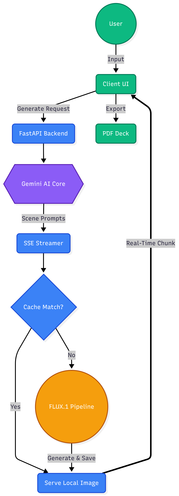

<div align="center">
  <h1>🎬 The Pitch Visualizer Pro</h1>
  <p>Transform raw narrative text into professional, AI-generated visual pitch decks in seconds.</p>
</div>

<br>

<div align="center">
  
</div>

<br>

## 📝 Project Overview & Capabilities
The Pitch Visualizer is a scalable, AI-powered presentation tool that programmatically ingests raw narrative text and constructs a stunning, multi-panel visual storyboard. Features include:
- Generating distinct cinematic frames based on user-selected styles (Cyberpunk, 3D Render, etc.).
- Auto-extracting "presenter speaking notes" for every generated scene.
- A beautiful, real-time minimal UI utilizing Server-Sent Events (SSE) for seamless live streaming.
- Full local PDF export capabilities.

## 🧠 Advanced Prompt Engineering Methodology
This project heavily relies on a multi-stage **LLM Prompt Chain** to ensure high fidelity and stylistic consistency in Gen-AI outputs. We tackle common image-generation constraints using the following engineered approaches:

### 1. The Director/Orchestrator Agent
Instead of directly passing user storylines to the image diffusion model (`FLUX.1-schnell`), we route the raw text through a reasoning layer (`Gemini 1.5 Flash`). This allows us to artificially inject meta-instructions that text-to-image models natively lack.

### 2. Contextual "Memory Tags" for Character Consistency
A major failing of text-to-image models is maintaining character likeness across different prompts. We instruct the LLM Director to dynamically synthesize a **Visual Character Memory Tag** at runtime (e.g., *"A 30-year-old woman with short curly black hair wearing a red trenchcoat"*). The LLM is structurally forced to prepend this precise tag to *every* independent scene frame sequentially, ensuring the final storyboard features identical protagonists across all images.

### 3. Cinematography Injection
Raw narrative text (e.g., *"He walked into the room"*) generates mediocre imagery. Our pipeline automatically enriches the diffusion prompt by injecting high-value cinematography keywords. The LLM acts as a camera operator, dictating precise:
- **Focal Lengths & Framing:** (e.g., *macro shot, 35mm portrait lens, extreme wide-angle, low dutch angle*)
- **Lighting Conditions:** (e.g., *volumetric lighting, cinematic rim light, golden hour, neon backlighting*)
- **Render Descriptors:** (e.g., *Unreal Engine 5 render, octane render, 8k resolution, photorealistic masterpiece*)

## ✨ Core Workflow Architecture
1. **Intelligent Segmentation:** Evaluates narrative flow to create structured JSON.
2. **Parallel Gen-AI Rendering:** Streams generated text payloads directly to Hugging Face APIs.
3. **Real-time SSE:** Streams panels progressively to the web UI to hide rendering latency.
4. **MD5 Asset Caching:** Heavily mitigates HuggingFace backend queue wait-times for previously generated matching prompts by hashing local directory requests.

## 📦 Setup & Execution Instructions

### Prerequisites
- Docker (Recommended) or Python 3.12+

### Step 1. Clone & Configure Secrets
```bash
git clone https://github.com/randomfucntion/pitch_visual.git
cd pitch_visual

# Create a local .env file in the root directory
touch .env
```
Inside your `.env` file, supply your API keys:
```env
HF_API_TOKEN=your_huggingface_token_here
GEMINI_API_KEY=your_gemini_token_here
```

### Step 2. Launch (Docker)
```bash
# Build the optimized python slim image
docker build -t pitchvisual .

# Run the container locally
docker run -p 8000:8000 --env-file .env pitchvisual
```
**Access the app at:** `http://localhost:8000`

### Step 2b. Launch (Native Python)
If you prefer not to use Docker:
```bash
python -m venv .darwix   # Or preferred venv name
source .darwix/bin/activate
pip install -r requirements.txt
uvicorn main:app --reload
```
